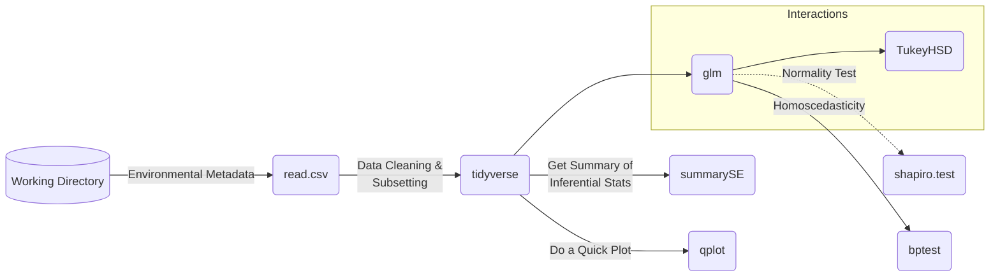

# dab-mermaid-chart

<h3 align="left">Impact of Vouchers on Revenue & Inventory:</h3>

```mermaid
flowchart TD
    A[Impact of Vouchers on Revenue & Inventory]
    A1[Revenue Impact]
    A2[Inventory Impact]
    A3[Strategic Recommendations]
    A4[Revenue Optimization]

    A --> A1
    A --> A2
    A --> A3
    A --> A4

    A1 --> A1a[Increased Sales Volume]
    A1 --> A1b[Profit Margin Impact]
    A1b --> A1b1[Dilution due to Voucher]
    A1b --> A1b2[Lowered Profit Margin (High COGS, High Price)]
    A1b --> A1b3[Potential Profit Loss]

    A2 --> A2a[Stock Movement & Lead Time]
    A2 --> A2b[Bulk Ordering vs Stock Purge]
    A2 --> A2c[Excess Inventory Risk]
    A2c --> A2c1[900+ SKUs, Slow-Moving Items]
    A2 --> A2d[Holding Costs]
    A2 --> A2e[Sunk Costs from Purging]
    A2 --> A2f[Donated Stock]
    A2 --> A2g[Cost of Unsold Stock]

    A3 --> A3a[Limit Vouchers on High-Margin Items]
    A3 --> A3b[Optimize Inventory Replenishment]
    A3 --> A3c[Improved Demand Forecasting]
    A3 --> A3d[Monitor Holding Costs]
    A3 --> A3e[Dynamic Purge Strategy]

    A4 --> A4a[Analyze Voucher Impact on Different SKUs]
    A4 --> A4b[Adjust Discount Strategy]
end
```
<h3 align="left">Physicochemical & Physiological Data:</h3>
  

