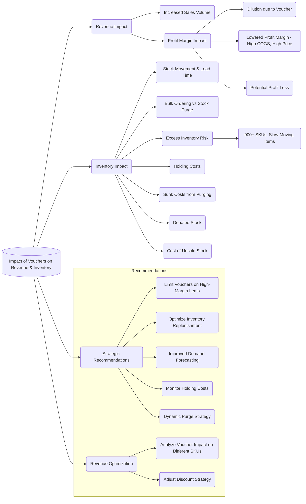
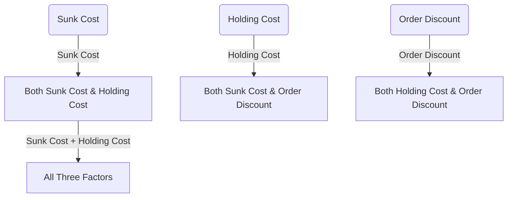
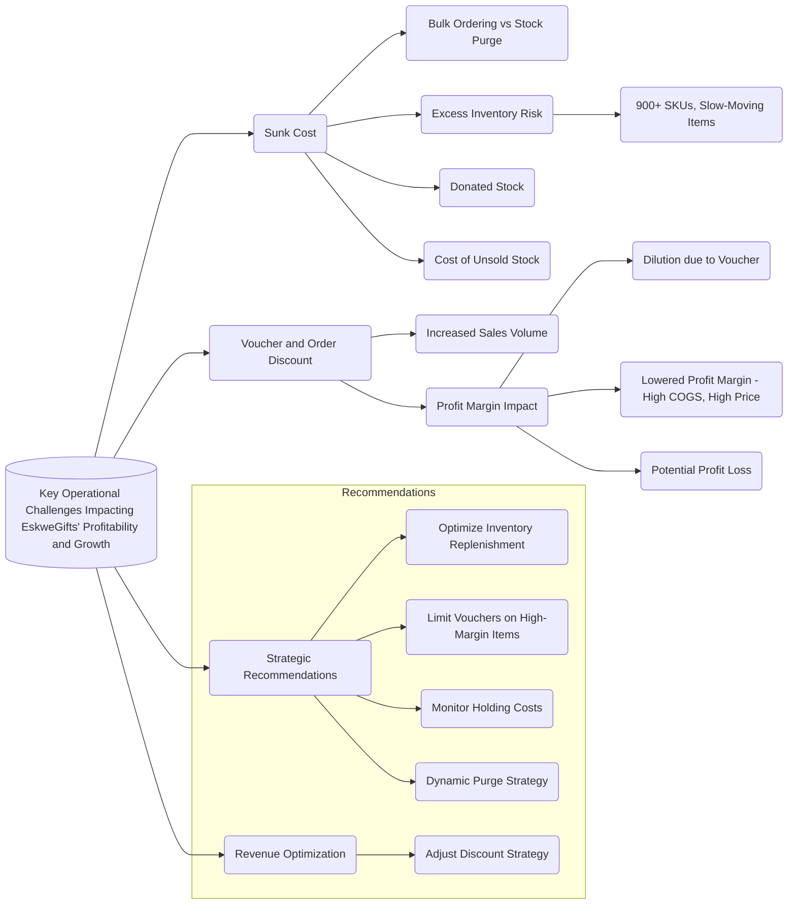

<h3 align="left">Impact of Vouchers on Revenue & Inventory:</h3>

#--------

<h3 align="left">Key Operational Challenges Impacting EskweGifts' Profitability and Growth:</h3>

#----------

<h3 align="left">Key Operational Challenges Impacting EskweGifts' Profitability and Growth:</h3>

